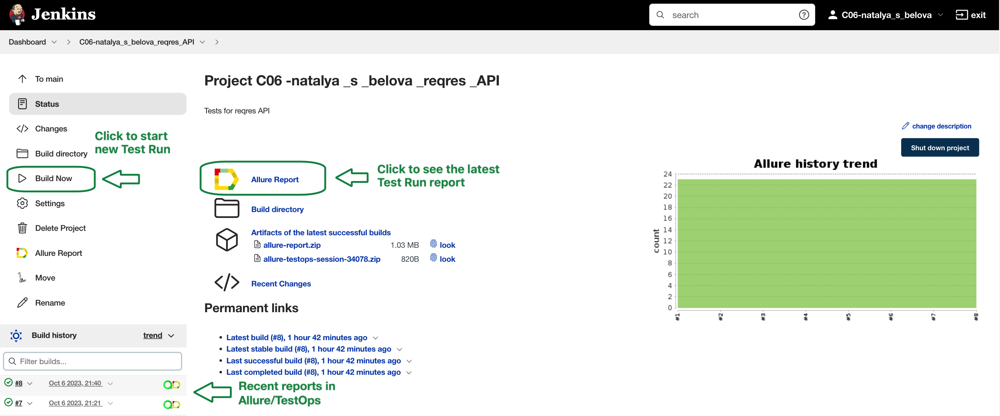
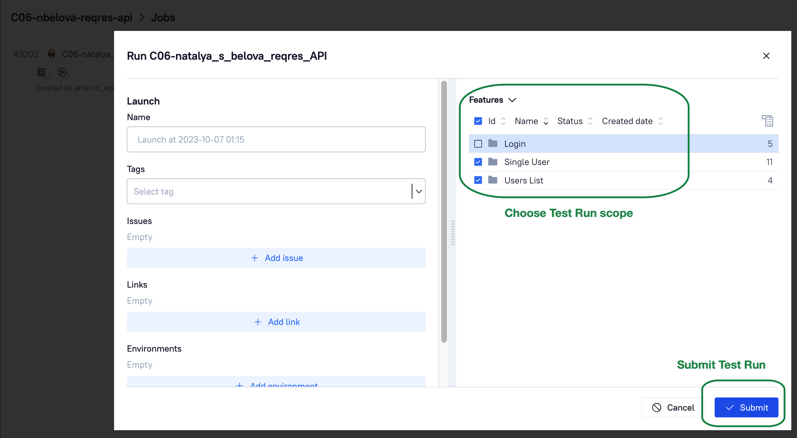

## Training project with API autotests for [reqres.in](https://reqres.in/) service

&nbsp;

### Tools and technologies used

### Test coverage

The following requests types are tested:
1. POST user
2. GET single user/users' list
3. PATCH user
4. DELETE USER
5. POST login

Tests verify:
1. Response code and schema (if applicable)
2. Response content
3. Request validity (data correctness in body/parameters, well-formed json in body)
4. User's avatar comparison with a reference

Example of test case's running (*POST user* request):

&nbsp;

### Test Launch
Tests are launching using **Jenkins service**.
To run tests, open the [configured job](https://jenkins.autotests.cloud/job/C06-natalya_s_belova_reqres_API/) and click 'Build now'.

&nbsp;

Also, since the integration with **Allure TestOps** is implemented, it is possible to run tests with this service. 
In Allure TestOps is also an additional ability to configure test scope by choosing specific test cases.

&nbsp;
&nbsp;

### Test Report and Test Documentation

Reporting is implemented using **Allure services**.

[Allure Report](https://jenkins.autotests.cloud/job/C06-natalya_s_belova_reqres_API/allure/) can be opened on Jenkins page (see screenshot above) and contains graphics, detalization of test executions, different kinds of attachments (logs, jsons, response codes, etc.).
&nbsp;
&nbsp;

**Allure TestOps** also contains such information and in addition it has generated Test Documentation that can be imported to Jira.
&nbsp;
&nbsp;

### Integration with Jira

Test Launches and Test Cases are integrated with Jira Task:
&nbsp;

### Test Results Notifications
As soon as Test Launch is completed, telegram message with the following information is sent:
* total amount of tests and run duration
* percentage of passed/failed/skipped/etc. tests
* link to the allure report

&nbsp;

For such messages to be sent, [notifications library](https://github.com/qa-guru/allure-notifications) was used, telegram bot was created and added to a specific telegram group.

### Configuration information for local run

#### Pre-requisites:
* git, python3 and allure (requires java as well) are installed

#### Steps:
1. close repository on our local machine
~~~
git clone https://github.com/natalia-s-belova/reqres_api_tests
~~~
2. create and activate virtual environment 
~~~
python -m venv .venv
source .venv/bin/activate             # for MacOS
source .venv\Scripts\activate         # for Windows
~~~
3. install dependencies
~~~
pip install -r requirements.txt
~~~
4. run all tests
~~~
pytest .
~~~

After test run is completed, use command to generate allure report for MacOS:
~~~
allure serve
~~~

for Windows:
~~~
allure.bat serve
~~~
As a result, you would get Allure report with the same content as demonstrated above.
You can close it by pressing Ctrl+C.
